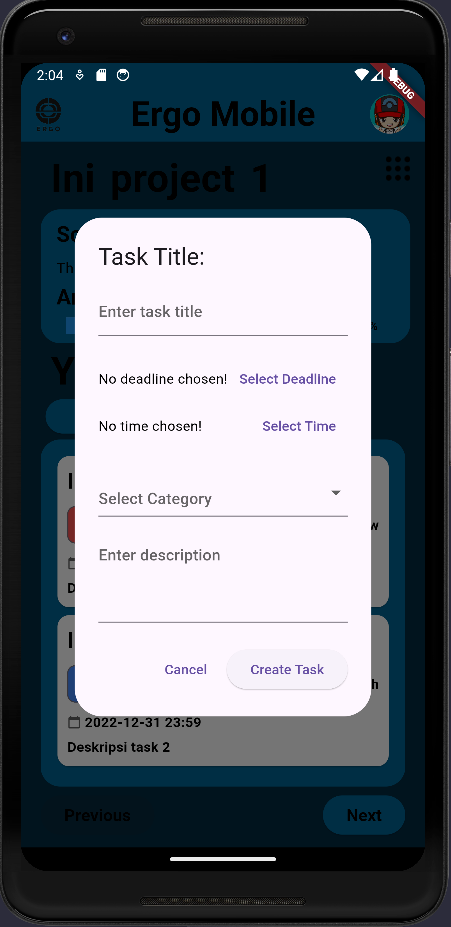

# Ergo Mobile 

Having numerous tasks is common for students or workers, and it's not unusual for them to struggle with managing these tasks. Therefore, Ergo Mobile was created. Ergo Mobile is a system designed to help individuals with many tasks by providing tools to track, manage, and monitor the progress of each task. This system allows users to organize their tasks efficiently and effectively, offering better visibility into the progress and status of each task.

Ergo Mobile is a mobile application that designed to help users manage task lists for various projects. With Ergo Mobile, users can easily create, organize, and track the progress of tasks that need to be completed. The application allows users to set deadlines, add notes, and prioritize tasks based on urgency or importance. Thus, Ergo Mobile becomes a very useful tool for individuals to manage their time and projects more efficiently.

## Prerequisites

Before you begin, ensure you have met the following requirements:

- **Flutter SDK**: Install Flutter SDK from [here](https://flutter.dev/docs/get-started/install).
- **Android Studio**: Install Android Studio from [here](https://developer.android.com/studio) and configure it with Flutter.
- **Xcode** (for iOS development): Install Xcode from the App Store.
- **A code editor**: You can use Visual Studio Code, Android Studio, or any other code editor of your choice.

## Installation

Follow these steps to set up the project:

1. **Clone the repository**:
    ```sh
    git clone https://github.com/sibobbbbbb/ergo_mobile.git
    cd ergo_mobile
    ```

2. **Install dependencies**:
    ```sh
    flutter pub get
    ```

3. **Set up your environment**:
    - **Android**: Open Android Studio, go to `AVD Manager`, and create a new virtual device or use a physical device.
    - **iOS**: Open the project in Xcode, and set up a new virtual device or use a physical device.

## Running the Application

1. **Run on Android**:
    ```sh
    flutter run
    ```

2. **Run on iOS**:
    ```sh
    flutter run
    ```

## Features

- **Board Management**: Create, view, edit, and delete boards.
- **Project Management**: Add projects to boards, view project details, and manage project status.
- **Favorites**: Mark boards as favorite for quick access.

## Usage

1. Open the app on your device or emulator.
2. Use the `+ Add New Board` button to create new boards.
3. Tap on any board to view and manage its projects.
4. Use the settings icon to mark a board as favorite or delete it.
5. Navigate between pages using the `Previous` and `Next` buttons.

## Troubleshooting

- **Emulator issues**: Ensure your emulator is configured correctly and has enough resources allocated (RAM, storage).
- **Dependency issues**: Run `flutter pub get` to ensure all dependencies are installed.

## Screenshot Program
 
 
<br>
 
 
<br>
 
<br>
